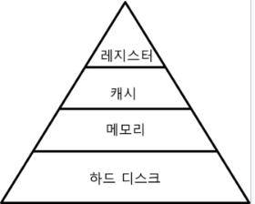

# 프로세스 스케쥴링
## :arrow_forward: 배치처리 시스템
하나의 프로세스를 끝내야만 다른 프로세스가 시작되는 방식  

이는 Queue의 FIFO 와 유사하다.  

먼저 들어갔으니 먼저나온다 = 먼저 시작된게 끝나야만 다른게 시작된다.  

 

## :arrow_forward: 시분할 시스템/ 멀티 태스킹

여러 프로그램을 동시에 실행하는 방식  

단, 멀티 태스킹과 멀티 프로세싱은 차이점이 있다.  

- 멀티태스킹 : [단일 CPU]  
결국 어느 시점에 작동중인 응용프로그램은 하나지만 여러개를 번갈아 가면서 실행시키므로 동시에 여러개가 실행되는것 처럼 보인다.  

- 멀티프로세싱 : [여러 CPU]  
하나의 응용프로그램을 여러개의 CPU가 병렬로 실행하여 실행속도를 극대화 시킨다.  
 

## :arrow_forward: 멀티 프로그래밍

최대한 CPU를 많이 활용하는 시스템으로 시간대비 CPU 활용도를 높인다. 응용프로그램을 짧은 시간안에 완료할 수 있다.  

응용프로그램이 온전히 CPU만 사용하는 경우는 생각보다 드물기 때문에 멀티 프로그램의 역할이 크게 작용한다.  

특히 메모리 계층구조에서 보이는것 처럼 응용프로그램이 하드디스크를 사용한다면 CPU(레지스터,캐시)만 사용할때 보다 기다리는 시간이 훨씬 길어지기 때문에 멀티 프로그래밍이 필요하다.  
(계층구조 아래로 갈수록 CPU에서의 접근속도가 오래걸린다)  

  

 

## :arrow_forward: 프로세스

- 프로세스 : 메모리에 올려져서 실행중인 프로그램
- 코드 이미지(바이너리) : 실행파일
- 프로세서 : 프로세스와 다른것임을 기억하자(CPU)

프로세스는 작업, task, job 용어와 혼용한다.  

단, 응용프로그램이 다 프로세스는 아니다.  

응용프로그램은 여러개의 프로세스로 이루어 질 수 있다.  

특히 하나의 응용프로그램은 여러개의 프로세스(프로그램)의 상호작용으로 실행될 수도 있다.  
 

## :arrow_forward: RTOS, GPOS
- RealTIme OS : 응용 프로그램의 정확한 시작, 완료시간을 보장하는 OS  

- General Purpose OS : 실행시간에 민갑하지 않은 일반적인 목적의 OS
 

## :arrow_forward: 스케쥴링 알고리즘

어느 순서대로 프로세스를 실행할지 관리하는것이 스케쥴러다.  

- FIFO 스케쥴러  
  - 가장 간단한 스케쥴러
  - 쭉 CPU를 처음부터 끝까지 사용한다.(배치처리)
  - 첫번쨰로 들어온 프로세스가 첫번째로 실행된다.(Queue)
  - FCFS(First Come First Served) 스케쥴러  

 

- 최단 작업 우선(SJF) 스케쥴러
  - Shortest Job First
  - 가장 프로세스 실행시간이 짧은 프로세스 부터 실행한다.  

 

- 우선순위 기반 스케쥴러
  - Priority-Based 스케쥴러
  - 정적 우선순위
    - 프로세스 마다 우선순위를 지정
  - 동적 우선순위
    - 스케쥴러가 상황에따라 우선순위를 동적으로 변경

 

- Round Robin 스케쥴러
  - 프로세스를 실행중 지정해둔 시간내에 완료되지 않으면 중단하고 다음 프로세스를 실행
  - 실행중이던 프로세스는 맨뒤로 미룸
  - 시분할 시스템과 비슷하다

 

## :arrow_forward: 프로세스 상태와 스케쥴링

- running state : 현재 CPU에서 실행 상태
- ready state : CPU에서 실행 가능 상태
- block state : 특정 이벤트 발생 대기 상태
  - running 상태에서 저장매체의 파일 읽기를 요청했다면 다 읽기 전까지는 block상태로 대기, 다 읽었다면 ready로 변경 후 다시 running   

 

## :arrow_forward: 그럼 어떤걸 먼저 ready-> running으로 선택할까 ?

Ready State Queue, Running State Queue, Block State Queue 세개의 큐를 만들어서 활용한다.  

1. 요청된 프로세스의 순서대로 Ready State Queue 에 넣는다.
2. CPU는 Ready의 프로세스 하나를 pop하고 Running Queue에 넣는다.
3. Running 중인 프로세스가 완료되면 Ready Queue의 다음 프로세스를 다시 pop 하여 반복한다.
4. 만약 Running 중 Block 상태가 되고 다시 Ready 상태가 되면 Ready Queue의 가장 뒤에 넣는다.
5. Ready State Queue 가 비워질때 까지 반복한다.

(참고로 CPU에서 어떤 프로세스도 진행중이 아닐때 idle 상태라고 한다)  

단, 무조건 Queue를 사용하는것이 아니라 상황에 따라 우선순위 같은 다양한 알고리즘을 적용할 수 있음을 기억하자.  

 

## :arrow_forward: 선점형과 비선점형 스케쥴러
  
- 선점형 스케쥴러
  - 하나의 프로세스가 다른 프로세스 대신 프로세서(CPU)를 차지할 수 있음
  - 프로세스가 실행중에도 수동으로 중지하고 다른 프로세스로 교체 가능
  - 비선점형에 비해 성능이 좋다

 

- 비선점형 스케쥴러
  - 하나의 프로세스가 끝나지 않으면 다른 프로세스는 CPU를 사용할 수 없음
  - 프로세스가 자발적으로 blocking 상태로 들어가거나, 실행이 끝났을 때만 다른 프로세스로 교체 가능  

 

## :arrow_forward: 알고리즘의 조합

- FIFO, SJF, Priorty-based 는 비선점형에 가깝다
- RoundRobin 은 선점형에 가깝다

최근의 알고리즘들은 이 알고리즘을 하나만 쓰지 않고 여러개를 조합하여 사용한다.  

예를들어 2초 단위로 시분할 프로그래밍을 사용하고 프로세스의 상태를 고려하며 정적 우선순위를 기반으로 시작한다. 이 모든 과정을 선점형으로 실행한다.  

 

## :arrow_forward: 인터럽트

CPU가 프로그램을 실행 중 입출력 하드웨어 등의 장치나 예외상황이 발생하여 처리가 필요할 경우 CPU에 알림을 보내 처리하는 기술  

하지만 CPU는 한번에 명령 하나만 실행하는데 어떻게 다른 장치와 커뮤니케이션하여 인터럽트를 발생시키는 것일까 ?  

