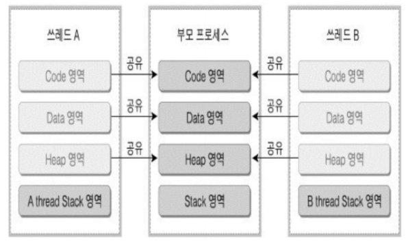

# 쓰레드

- Light Weight Process 라고도 함
- 프로세스 간에는 각 프로세스의 데이터 접근이 불가
- 하나의 프로세스에 여러개의 스레드 생성 가능
- 스레드들은 동시에 실행 가능
  - Thread는 각기 실행이 가능한 stack이 존재한다
- 프로세스 안에 있으므로, 프로세스의 데이터를 모두 접근 가능  

## Mulit Thread 
소프트웨어 병행 작업 처리를 위해 멀티스레드를 사용한다.  
최근 CPU는 멀티코어를 가지므로 쓰레드를 여러개 만들어 멀티 코어 활용도를 높인다.  

  

 

## 쓰레드 장점
- 사용자에 대한 응답성 향상
- 자원 공유 효율
  - IPC 기법과 같이 프로세스간 자원 공유를 위해 번거로운 작업이 필요없음
  - 프로세스 안에 있으므로, 프로세스의 데이터를 모두 접근 가능
- 작업이 분리되어 코드가 간결  

 

## 쓰레드 단점
멀티 프로세스는 하나의 프로세스가 문제행겨도 다른 프로세스는 작동하지만,  

쓰레드는 한 쓰레드만 문제가 생겨도 전체 프로세스가 영향 받을 수 있다.  

- 쓰레드를 많이 생성하면 Context Switching이 많이 일어나 성능이 저하된다
  - 리눅스에서는 쓰레드를 프로세스처럼 다룬다
  - 쓰레드를 많이 생성하면 모든 쓰레드를 스케쥴링 해야하므로 Context Switchin이 많이 일어날 수 밖에 없다
 

## 쓰레드와 프로세스
- 프로세스는 독립적, 스레드는 프로세스의 서브셋
- 프로세스는 독립적인 자원을 가짐, 쓰레드는 프로세스 자원 공유
- 프로세스는 자신만의 주소영역 가짐, 쓰레드는 주소영역 공유
- 프로세스간에는 IPC 기법으로 통신하지만, 쓰레드는 필요 없음

 

## PThread
- POSIX 스레드(POSIX Threads, 약어 : PThread)
- Thread 관련 표준 API

 

## 동기화 (Synchronization)
- 작업들 사이에 실행 시기를 맞추는것
- 여러 스레드가 동일한 자원(데이터) 접근 시 동기화 이슈 발생
  - 동일 자원을 여러 스레드가 동시 수정시, 각 스레드 결과에 영향주는 것

동기화 이슈를 해결하려면 상호 배제를 활용(Mutual exclusion)  

쓰레드는 프로세스의 모든 데이터에 접근 가능하므로 여러 스레드가 변경하는 공유변수에 대해 Exclusive Access 가 필요하다.  

어느 한 스레드가 공유 변수를 갱신하는 동안 다른 스레드가 동시 접근하지 못하도록 해야한다.  

 

## Mutex , Semaphore

- Critical Section( 임계 구역)에 대한 접근을 막기 위해 LOCKING 메커니즘이 필요
  - Mutex(binary semaphore) : 임계구역에 하나의 스레드만 들어갈 수 있음
  - Semaphore : 임계구역에 여러 스레드가 들어갈 수 있음 
    - counter 를 두어서 동시에 리소스에 접근 할 수 있는 허용 가능한 스레드 수를 제어  

세마포어 (Semaphore)  
- P: 검사 (임계영역에 들어갈 때)
  - S 값이 1 이상이면, 임계 영역 진입 후, S값 1 차감 (S값이 0이면 대기)
- V: 증가 (임계영역에서 나올 때)
  - S 값을 1 더하고, 임계 영역을 나옴
- S: 세마포어 값 (초기 값만큼 여러 프로세스가 동시 임계 영역 접근 가능)