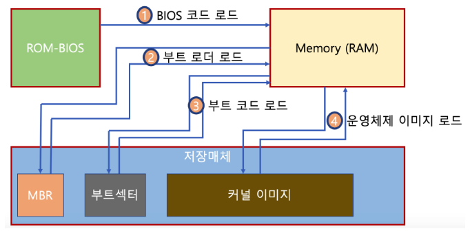

# 부팅

컴퓨터를 키면 BIOS가 특정 Storage를 읽고 bootstrap loader를 메모리에 올려 실행한다.  

  

 

# 가상머신 (Virtual Machine)

가상머신은 하나의 하드웨어에 다수의 운영체제를 설치하고, 개별 컴퓨터처럼 동작하돌고 하는 프로그램이다.  

AWS에서 사용하는 KVM 과 Docker 그리고 JVM 대해 알아두는것이 웹개발에 도움된다.  

## :arrow_forward: KVM

## :arrow_forward: Docker

## :arrow_forward: JVM